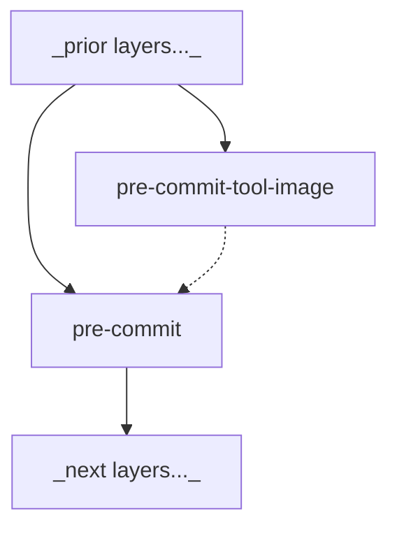

# dockerfile-partials<a name="dockerfile-partials"></a>

Dockerfile partials and devcontainer [bake](https://docs.docker.com/build/bake/introduction/) files
for re-use across multiple applications.

<!-- mdformat-toc start --slug=github --maxlevel=6 --minlevel=1 -->

- [dockerfile-partials](#dockerfile-partials)
  - [GitHub cache bake file](#github-cache-bake-file)
    - [GitHub cache bake file usage](#github-cache-bake-file-usage)
    - [GitHub cache bake file inputs](#github-cache-bake-file-inputs)
  - [Devcontainer bake files](#devcontainer-bake-files)
    - [Devcontainer bake files devcontainer-cache-build usage](#devcontainer-bake-files-devcontainer-cache-build-usage)
      - [Devcontainer bake files devcontainer-cache-build initializeCommand config](#devcontainer-bake-files-devcontainer-cache-build-initializecommand-config)
      - [Devcontainer bake files devcontainer-cache-build .devcontainer/devcontainer-bake.hcl config](#devcontainer-bake-files-devcontainer-cache-build-devcontainerdevcontainer-bakehcl-config)
    - [Devcontainer bake files direct usage](#devcontainer-bake-files-direct-usage)
  - [Devcontainer script integration](#devcontainer-script-integration)
  - [Dockerfile partials](#dockerfile-partials)
    - [docker-client](#docker-client)
      - [docker-client Dockerfile usage](#docker-client-dockerfile-usage)
      - [docker-client bake file usage](#docker-client-bake-file-usage)
      - [docker-client devcontainer usage](#docker-client-devcontainer-usage)
    - [pre-commit](#pre-commit)
      - [pre-commit Dockerfile usage](#pre-commit-dockerfile-usage)
      - [pre-commit bake file usage](#pre-commit-bake-file-usage)
      - [pre-commit Codespaces usage](#pre-commit-codespaces-usage)
    - [pyenv](#pyenv)
      - [pyenv Dockerfile usage](#pyenv-dockerfile-usage)
      - [pyenv bake file usage](#pyenv-bake-file-usage)
    - [tmux](#tmux)
      - [tmux Dockerfile usage](#tmux-dockerfile-usage)
      - [tmux bake file usage](#tmux-bake-file-usage)
    - [useradd](#useradd)
      - [useradd Dockerfile usage](#useradd-dockerfile-usage)
      - [useradd bake file usage](#useradd-bake-file-usage)
      - [useradd Codespaces usage](#useradd-codespaces-usage)
    - [uv-project](#uv-project)
      - [uv-project Dockerfile usage](#uv-project-dockerfile-usage)
      - [uv-project devcontainer bake file usage](#uv-project-devcontainer-bake-file-usage)
      - [uv-project bake file usage](#uv-project-bake-file-usage)
    - [Zsh](#zsh)
      - [Zsh Dockerfile usage](#zsh-dockerfile-usage)
      - [Zsh bake file usage](#zsh-bake-file-usage)
  - [pre-commit reusable workflow](#pre-commit-reusable-workflow)
    - [pre-commit reusable workflow usage](#pre-commit-reusable-workflow-usage)
    - [pre-commit reusable workflow inputs](#pre-commit-reusable-workflow-inputs)
  - [Contributing](#contributing)
    - [devcontainer](#devcontainer)
      - [devcontainer basic usage](#devcontainer-basic-usage)
      - [devcontainer Codespaces usage](#devcontainer-codespaces-usage)
      - [devcontainer pre-commit usage](#devcontainer-pre-commit-usage)
    - [CI/CD](#cicd)
    - [Settings](#settings)

<!-- mdformat-toc end -->

## GitHub cache bake file<a name="github-cache-bake-file"></a>

The `github-cache-bake.hcl` [bake](https://docs.docker.com/build/bake/introduction/) config file
provides a basic bake configuration for use in repos that produce container images using
[GitHub Actions](https://docs.github.com/en/actions) and targeted to the
[GitHub container registry](https://docs.github.com/en/packages/working-with-a-github-packages-registry/working-with-the-container-registry).

The file configures
[registry outputs](https://docs.docker.com/reference/cli/docker/buildx/build/#registry) and registry
[cache-to](https://docs.docker.com/reference/cli/docker/buildx/build/#cache-to) and
[cache-from](https://docs.docker.com/reference/cli/docker/buildx/build/#cache-from), all directed to
the specified registry. It infers naming and tagging config for the image based on the context
(local vs. CI, protected vs. development versions), such that while each context can push both image
and cache content, development and local contexts do not collide with each other or with releases.

### GitHub cache bake file usage<a name="github-cache-bake-file-usage"></a>

The configuration of the bake file requires the use of a
[Docker builder with the docker-container driver](https://docs.docker.com/build/builders/drivers/docker-container/).
To set one up, use the following command:

```bash
docker builder create --use --bootstrap --driver docker-container
```

The bake file requires at least `IMAGE_NAME` variable to be set, and `REGISTRY` should nearly always
be overridden (see [GitHub cache bake file inputs](#github-cache-bake-file-inputs)). Export them:

```bash
REGISTRY=ghcr.io/[your account]
IMAGE_NAME=[image name]
```

By default, the `github-cache-bake.hcl` file expects a Dockerfile in the bake command execution
directory (via `cwd://Dockerfile`), which is used for the build. It sets the default
[`context`](https://docs.docker.com/build/bake/reference/#targetcontext) to `BAKE_CMD_CONTEXT` such
that the filesystem local to the bake execution are available to the image build.

To build your image using the GitHub cache bake file via
[remote bake definition](https://docs.docker.com/build/bake/remote-definition/), run this command:

```bash
REGISTRY=ghcr.io/[your account] IMAGE_NAME=[image name] docker buildx bake --file github-cache-bake.hcl https://github.com/rcwbr/dockerfile-partials.git#0.11.0
```

### GitHub cache bake file inputs<a name="github-cache-bake-file-inputs"></a>

The GitHub cache bake file can be configured using the following inputs:

| Variable               | Required | Default                         | Effect                                                                                                                           |
| ---------------------- | -------- | ------------------------------- | -------------------------------------------------------------------------------------------------------------------------------- |
| `IMAGE_NAME`           | ✓        | N/A                             | The name of the image, specifically not fully-qualified. This is the reference loaded to the host Docker daemon.                 |
| `GITHUB_REF_NAME`      | ✗        | `"local-${HOST}"`               | The human-friendly ref name for the GitHub context. Used to inform the image tag.                                                |
| `GITHUB_REF_PROTECTED` | ✗        | `"false"`                       | Indicates if the CI context is for a protected (vs. development) ref. Indicates whether to append a unique version ID to the tag |
| `GITHUB_SHA`           | ✗        | `"local"`                       | The commit SHA of the CI context. Appended to tags after `VERSION` unless `GITHUB_REF_PROTECTED` is true.                        |
| `HOST`                 | ✗        | `$HOSTNAME`                     | The name of the host device. Used to qualify image and cache names and avoid collisions between users.                           |
| `HOSTNAME`             | ✗        | N/A                             | The name of the host device, for some OSs.                                                                                       |
| `REGISTRY`             | ✗        | `"ghcr.io/"`                    | The registry to which to push remote content. Generally, `"ghcr.io/[user/org]/"`.                                                |
| `IMAGE_REF`            | ✗        | `"${REGISTRY}${IMAGE_NAME}"`    | The fully-qualified image name used as the base for version and cache references.                                                |
| `VERSION`              | ✗        | `${GITHUB_REF_NAME}`, sanitized | This is the default tag for the image.                                                                                           |

## Devcontainer bake files<a name="devcontainer-bake-files"></a>

Each Dockerfile partial is accompanied by a `devcontainer-bake.hcl`
[bake](https://docs.docker.com/build/bake/introduction/) config file, and a common bake file is
defined at the repository root. These are intended to make composition of devcontainer image
contents trivial. They are designed to work with the
[devcontainer-cache-build initialize script](https://github.com/rcwbr/devcontainer-cache-build/tree/main?tab=readme-ov-file#initialize-script).

Using these bake files remotely requires setting the primary build context to this repo by
[remote definition](https://docs.docker.com/build/bake/remote-definition/). Because of
[this limitation of remote bake build contexts](https://github.com/docker/buildx/blob/056cf8a7ca083d91eccf9200e7e2c99ff170bbaf/bake/bake.go#L1213C6-L1213C73)

> `We don't currently support reading a remote Dockerfile with a local context when doing a remote invocation because we automatically derive the dockerfile from the context atm`

this means that any build contexts required by the Dockerfile partial must be provided via a
[local directory `contexts` context](https://docs.docker.com/build/bake/reference/#targetcontexts)
rather than the primary build context. For example, the `pre-commit` Dockerfile
[reads from the `local_context` context](https://github.com/rcwbr/dockerfile-partials/blob/0.11.02fb92beb8ab2bf887ff6a6a141804762eb9/pre-commit/Dockerfile#L10C26-L10C39)
[set to `BAKE_CMD_CONTEXT`](https://github.com/rcwbr/dockerfile-partials/blob/0.11.02fb92beb8ab2bf887ff6a6a141804762eb9/pre-commit/devcontainer-bake.hcl#L11).
This allows it to consume contents of the downstream build context.

### Devcontainer bake files devcontainer-cache-build usage<a name="devcontainer-bake-files-devcontainer-cache-build-usage"></a>

In a `devcontainer.json` leveraging the
[devcontainer-cache-build initialize script](https://github.com/rcwbr/devcontainer-cache-build/tree/main?tab=readme-ov-file#initialize-script),
several fields must be configured to fully integrate. These include:

1. The `initializeCommand` (see
   [Devcontainer bake files devcontainer-cache-build initializeCommand config](#devcontainer-bake-files-devcontainer-cache-build-initializecommand-config))
1. For some images, such as [pre-commit](#pre-commit) and [Zsh](#zsh), map `onCreateCommand` to
   `"/opt/devcontainers/on_create_command"`
1. For some images, map `postCreateCommand` to `"/opt/devcontainers/post_create_command"`

#### Devcontainer bake files devcontainer-cache-build initializeCommand config<a name="devcontainer-bake-files-devcontainer-cache-build-initializecommand-config"></a>

Add the following configuration to the script called by `initializeCommand` before the `curl` to the
initialize script:

```bash
# .devcontainer/initialize
export DEVCONTAINER_DEFINITION_TYPE=bake
export DEVCONTAINER_DEFINITION_FILES="devcontainer-bake.hcl [path to each desired partial bake file] cwd://.devcontainer/devcontainer-bake.hcl"
export DEVCONTAINER_BUILD_ADDITIONAL_ARGS=https://github.com/rcwbr/dockerfile-partials.git#0.11.0
curl https://raw.githubusercontent.com/rcwbr/devcontainer-cache-build/0.11.0/devcontainer-cache-build-initialize | bash
```

`DEVCONTAINER_DEFINITION_FILES` must begin with `devcontainer-bake.hcl` and end with
`cwd://.devcontainer/devcontainer-bake.hcl` (see
[Devcontainer bake files devcontainer-cache-build .devcontainer/devcontainer-bake.hcl config](#devcontainer-bake-files-devcontainer-cache-build-devcontainerdevcontainer-bakehcl-config)),
and with each desired partial bake file in between (ordering is important for override priority).
For example:

```bash
export DEVCONTAINER_DEFINITION_FILES="devcontainer-bake.hcl useradd/devcontainer-bake.hcl pre-commit/devcontainer-bake.hcl cwd://.devcontainer/devcontainer-bake.hcl"
```

#### Devcontainer bake files devcontainer-cache-build .devcontainer/devcontainer-bake.hcl config<a name="devcontainer-bake-files-devcontainer-cache-build-devcontainerdevcontainer-bakehcl-config"></a>

To join the devcontainer partial bake files, you must define a bake file local to your project that
configures targets from each partial you select. It must define at least the `devcontainer_layers`
variable as a list with the names of each selected partial, and override the `base_context` for at
least the first partial target. For example:

```hcl
variable "devcontainer_layers" {
  default = [
    "useradd",
    "pre-commit"
  ]
}

target "useradd" {
  contexts = {
    base_context = "docker-image://python:3.12.4"
  }
}
```

Optionally, `target`s may be configured for each layer. Values provided to these will override those
defined in the partials `devcontainer-bake.hcl`.

### Devcontainer bake files direct usage<a name="devcontainer-bake-files-direct-usage"></a>

The partial bake files may be used manually through a command like this:

```bash
docker buildx bake --file devcontainer-bake.hcl [--file arg for each desired partial bake file] --file cwd://.devcontainer/devcontainer-bake.hcl https://github.com/rcwbr/dockerfile-partials.git#0.11.0
```

## Devcontainer script integration<a name="devcontainer-script-integration"></a>

## Dockerfile partials<a name="dockerfile-partials"></a>

### docker-client<a name="docker-client"></a>

The docker-client Dockerfile defines steps to install the
[Docker CLI client](https://docs.docker.com/reference/cli/docker/) in a Docker image. It copies the
CLI executable from the [Docker docker image](https://hub.docker.com/_/docker).

#### docker-client Dockerfile usage<a name="docker-client-dockerfile-usage"></a>

The recommended usage is via the [Devcontainer bake files](#devcontainer-bake-files). It is also
possible to use the Dockerfile partial directly.

Use a [Bake](https://docs.docker.com/reference/cli/docker/buildx/bake/) config file, and set the
`base_context` context as the image to which to apply the docker-client installation. For example:

```hcl
target "base" {
  dockerfile = "Dockerfile"
}

target "default" {
  context = "https://github.com/rcwbr/dockerfile_partials.git#0.11.0"
  dockerfile = "docker-client/Dockerfile"
  contexts = {
    base_context = "target:base"
  }
}
```

The args accepted by the Dockerfile include:

| Variable     | Required | Default  | Effect                                        |
| ------------ | -------- | -------- | --------------------------------------------- |
| `DOCKER_GID` | ✗        | `800`    | Group ID of the docker user group             |
| `USER`       | ✗        | `"root"` | Username to grant access to the Docker daemon |

#### docker-client bake file usage<a name="docker-client-bake-file-usage"></a>

The docker-client partial contains a devcontainer bake config file. See
[Devcontainer bake files](#devcontainer-bake-files) for general usage. The docker-client bake config
file accepts the following inputs:

| Variable     | Required | Default  | Effect                                                          |
| ------------ | -------- | -------- | --------------------------------------------------------------- |
| `DOCKER_GID` | ✗        | `800`    | See [docker-client Dockerfile](#docker-client-dockerfile-usage) |
| `USER`       | ✗        | `"root"` | See [docker-client Dockerfile](#docker-client-dockerfile-usage) |

#### docker-client devcontainer usage<a name="docker-client-devcontainer-usage"></a>

The docker-client partial installs only the client CLI by default. To leverage the container host's
Docker daemon, the relevant socket must be mounted at runtime. In a
[`devcontainer.json`](https://containers.dev/implementors/json_reference/), the following content
must be included:

```jsonc
{
  "image": "[image including docker-client layers]",
  "mounts": [
    { "source": "/var/run/docker.sock", "target": "/var/run/docker.sock", "type": "bind" }
  ]
}
```

### pre-commit<a name="pre-commit"></a>

The pre-commit layer defines steps to install [pre-commit](https://pre-commit.com/) and install the
hooks required by a repo configuration.

This layer produces an accompanying tool image that contains pre-commit executions, while the main
image presents that tool image as the pre-commit executable:



> :warning: Use of the pre-commit layer requires that the variable
> `DEVCONTAINER_HOST_WORKSPACE_MOUNT` be provided and set to the path of the workspace on the _host_
> filesystem. This informs the workspace mount for the pre-commit-tool-image container.

#### pre-commit Dockerfile usage<a name="pre-commit-dockerfile-usage"></a>

The recommended usage is via the [Devcontainer bake files](#devcontainer-bake-files). It is also
possible to use the Dockerfile partial directly.

Use a [Bake](https://docs.docker.com/reference/cli/docker/buildx/bake/) config file, and set the
`base_context` context as the image to which to apply the pre-commit installation, and the
`local_context` to the directory from which the `.pre-commit-config.yaml` can be loaded (generally
[`BAKE_CMD_CONTEXT`](https://docs.docker.com/build/bake/reference/#built-in-variables)).
Additionally, provide appropriate values for the `USER` build arg. For example:

```hcl
target "base" {
  dockerfile = "Dockerfile"
}

target "default" {
  context = "https://github.com/rcwbr/dockerfile_partials.git#0.11.0"
  dockerfile = "pre-commit/Dockerfile"
  contexts = {
    base_context = "target:base"
    local_context = BAKE_CMD_CONTEXT
  }
  args = {
    USER = "myuser"
  }
}
```

The args accepted by the Dockerfile include:

| Variable | Required | Default  | Effect                                  |
| -------- | -------- | -------- | --------------------------------------- |
| `USER`   | ✗        | `"root"` | Username to assume for hook pre-loading |

#### pre-commit bake file usage<a name="pre-commit-bake-file-usage"></a>

The pre-commit partial contains a devcontainer bake config file. See
[Devcontainer bake files](#devcontainer-bake-files) for general usage. The pre-commit bake config
file accepts the following inputs:

| Variable                     | Required | Default                                                                               | Effect                                                                                     |
| ---------------------------- | -------- | ------------------------------------------------------------------------------------- | ------------------------------------------------------------------------------------------ |
| `USER`                       | ✗        | `"root"`                                                                              | See [pre-commit Dockerfile](#pre-commit-dockerfile-usage)                                  |
| `DEVCONTAINER_REGISTRY`      | ✓        | `""`                                                                                  | The registry to which the pre-commit-tool-image belongs                                    |
| `DEVCONTAINER_IMAGE`         | ✓        | `""`                                                                                  | The base devcontainer image name to which naming for the pre-commit image will be appended |
| `GIT_BRANCH_SANITIZED`       | ✓        | `""`                                                                                  | The context Git branch name, sanitized for use as a Docker image tag                       |
| `PRE_COMMIT_TOOL_IMAGE_NAME` | ✗        | `"${DEVCONTAINER_REGISTRY}/${DEVCONTAINER_IMAGE}-pre-commit:${GIT_BRANCH_SANITIZED}"` | The name of the pre-commit-tool-image                                                      |

The
[`devcontainer-bake.hcl` config `devcontainer_layers` variable](#devcontainer-bake-files-devcontainer-cache-build-devcontainerdevcontainer-bakehcl-config)
must list each of the pre-commit targets; `pre-commit-base`, `pre-commit-tool-image`, and
`pre-commit`.

For example:

```hcl
variable "devcontainer_layers" {
  default = [
    "docker-client",
    "useradd",
    "pre-commit-base",
    "pre-commit-tool-image",
    "pre-commit"
  ]
}
```

#### pre-commit Codespaces usage<a name="pre-commit-codespaces-usage"></a>

For use in [Codespaces](https://github.com/features/codespaces) devcontainers, the build args must
be set to the following values:

- `USER`: `codespace`

These values may be hard-coded in the Bake config file, or may be exposed as variables for
compatibility with local environments.

```hcl
variable "USER" {
  default = "root"
}
...
  args = {
    USER = "${USER}"
  }
...
```

If exposed as variables, the appropriate values for Codespaces use must be
[set as secrets](https://docs.github.com/en/codespaces/managing-your-codespaces/managing-your-account-specific-secrets-for-github-codespaces#adding-a-secret)
so as to be available during Codespace provisioning.

In a `devcontainer.json` for a Codespace, the `DEVCONTAINER_HOST_WORKSPACE_MOUNT` var should be set
to `/var/lib/docker/codespacemount/workspace/[repo name]`, e.g.:

```json
{
  "containerEnv": {
    "DEVCONTAINER_HOST_WORKSPACE_MOUNT": "/var/lib/docker/codespacemount/workspace/dockerfile-partials"
  },
}
```

### pyenv<a name="pyenv"></a>

The pyenv layer defines steps to install [pyenv](https://github.com/pyenv/pyenv), leverage it to
install a specified version of Python, and prepare a virtualenv based on that Python installation.

#### pyenv Dockerfile usage<a name="pyenv-dockerfile-usage"></a>

The recommended usage is via the [Devcontainer bake files](#devcontainer-bake-files). It is also
possible to use the Dockerfile partial directly.

Use a [Bake](https://docs.docker.com/reference/cli/docker/buildx/bake/) config file, and set the
`base_context` context as the image to which to apply the pyenv installation. For example:

```hcl
target "base" {
  dockerfile = "Dockerfile"
}

target "default" {
  context = "https://github.com/rcwbr/dockerfile_partials.git#0.11.0"
  dockerfile = "pyenv/Dockerfile"
  contexts = {
    base_context = "target:base"
  }
}
```

The args accepted by the Dockerfile include:

| Variable          | Required | Default                    | Effect                               |
| ----------------- | -------- | -------------------------- | ------------------------------------ |
| `PYTHON_VERSION`  | ✗        | `3.12.4`                   | The version of Python to install     |
| `VIRTUALENV_NAME` | ✗        | `venv`                     | The name of the virtualenv to create |
| `PYENV_ROOT`      | ✗        | `/opt/devcontainers/pyenv` | The path in which to install Pyenv   |

#### pyenv bake file usage<a name="pyenv-bake-file-usage"></a>

The pyenv partial contains a devcontainer bake config file. See
[Devcontainer bake files](#devcontainer-bake-files) for general usage.

### tmux<a name="tmux"></a>

The tmux Dockerfile defines steps to install [tmux](https://github.com/tmux/tmux) in a Docker image.

#### tmux Dockerfile usage<a name="tmux-dockerfile-usage"></a>

The recommended usage is via the [Devcontainer bake files](#devcontainer-bake-files). It is also
possible to use the Dockerfile partial directly.

Use a [Bake](https://docs.docker.com/reference/cli/docker/buildx/bake/) config file, and set the
`base_context` context as the image to which to apply the tmux installation. For example:

```hcl
target "base" {
  dockerfile = "Dockerfile"
}

target "default" {
  context = "https://github.com/rcwbr/dockerfile_partials.git#0.11.0"
  dockerfile = "tmux/Dockerfile"
  contexts = {
    base_context = "target:base"
  }
}
```

#### tmux bake file usage<a name="tmux-bake-file-usage"></a>

The tmux partial contains a devcontainer bake config file. See
[Devcontainer bake files](#devcontainer-bake-files) for general usage. The tmux bake config file
accepts no inputs.

### useradd<a name="useradd"></a>

The useradd Dockerfile defines steps to add a user to the image, with configurable user name, id,
and group id.

#### useradd Dockerfile usage<a name="useradd-dockerfile-usage"></a>

The recommended usage is via the [Devcontainer bake files](#devcontainer-bake-files). It is also
possible to use the Dockerfile partial directly.

Use a [Bake](https://docs.docker.com/reference/cli/docker/buildx/bake/) config file, and set the
`base_context` context as the image to which to apply the user addition. Additionally, provide
appropriate values for the `USER`, `USER_UID`, and `USER_GID` build args. For example:

```hcl
target "base" {
  dockerfile = "Dockerfile"
}

target "default" {
  context = "https://github.com/rcwbr/dockerfile_partials.git#0.11.0"
  dockerfile = "useradd/Dockerfile"
  contexts = {
    base_context = "target:base"
  }
  args = {
    USER = "myuser"
    USER_UID = 1000
    USER_GID = 1000
  }
}
```

The args accepted by the Dockerfile include:

| Variable         | Required | Default     | Effect                                                  |
| ---------------- | -------- | ----------- | ------------------------------------------------------- |
| `USER`           | ✓        | N/A         | Username of the user to create                          |
| `EXTRA_GID_ARGS` | ✗        | `""`        | Extra `--gid [id]` args to apply to the useradd command |
| `USER_UID`       | ✗        | `1000`      | User UID for the user to create                         |
| `USER_GID`       | ✗        | `$USER_UID` | User GID for the user to create                         |

#### useradd bake file usage<a name="useradd-bake-file-usage"></a>

The useradd partial contains a devcontainer bake config file. See
[Devcontainer bake files](#devcontainer-bake-files) for general usage. The useradd bake config file
accepts the following inputs:

| Variable         | Required | Default                                           | Effect                                                                  |
| ---------------- | -------- | ------------------------------------------------- | ----------------------------------------------------------------------- |
| `USER`           | ✗        | `"root"`                                          | See [useradd Dockerfile](#useradd-dockerfile-usage)                     |
| `EXTRA_GID_ARGS` | ✗        | `""` or `DOCKER_CLIENT_EXTRA_GID_ARGS` if defined | See [useradd Dockerfile](#useradd-dockerfile-usage)                     |
| `UID`            | ✗        | `0`                                               | Maps to `USER_UID`. See [useradd Dockerfile](#useradd-dockerfile-usage) |
| `GID`            | ✗        | `${UID}`                                          | Maps to `USER_GID`.See [useradd Dockerfile](#useradd-dockerfile-usage)  |

#### useradd Codespaces usage<a name="useradd-codespaces-usage"></a>

For use in [Codespaces](https://github.com/features/codespaces) devcontainers, the build args must
be set to the following values:

- `USER`: `codespace`
- `UID`: `1000`

These values may be hard-coded in the Bake config file, or may be exposed as variables for
compatibility with local environments.

```hcl
variable "USER" {
  default = "root"
}
variable "UID" {
  default = 0
}
variable "GID" {
  // Use the user id as group id unless set
  default = "${UID}"
}

...
  args = {
    USER = "${USER}"
    USER_UID = "${UID}"
    USER_GID = "${GID}"
  }
...
```

If exposed as variables, the appropriate values for Codespaces use must be
[set as secrets](https://docs.github.com/en/codespaces/managing-your-codespaces/managing-your-account-specific-secrets-for-github-codespaces#adding-a-secret)
so as to be available during Codespace provisioning.

### uv-project<a name="uv-project"></a>

The uv-project Dockerfile defines steps to prepare an environment to work with a Python project,
using the [uv tool](https://github.com/astral-sh/uv).

#### uv-project Dockerfile usage<a name="uv-project-dockerfile-usage"></a>

The recommended usage is via the [Devcontainer bake files](#devcontainer-bake-files). It is also
possible to use the Dockerfile partial directly.

Use a [Bake](https://docs.docker.com/reference/cli/docker/buildx/bake/) config file, and set the
`base_context` context as the image to which to apply the uv-project installation, the
`local_context` to the directory in which the Python project is defined, and the `UV_PACKAGE_NAME`
build arg to the name of the package. For example:

```hcl
target "base" {
  dockerfile = "Dockerfile"
}

target "default" {
  context = "https://github.com/rcwbr/dockerfile_partials.git#0.11.0"
  dockerfile = "uv-project/Dockerfile"
  contexts = {
    base_context = "target:base"
    local_context = BAKE_CMD_CONTEXT
  }
  args = {
    UV_PACKAGE_NAME = "<your package name>"
  }
}
```

#### uv-project devcontainer bake file usage<a name="uv-project-devcontainer-bake-file-usage"></a>

The uv-project partial contains a devcontainer bake config file. See
[Devcontainer bake files](#devcontainer-bake-files) for general usage. The uv-project bake config
file accepts no inputs.

#### uv-project bake file usage<a name="uv-project-bake-file-usage"></a>

The uv-project partial contains a bake config file for providing. The uv-project bake config file
accepts no inputs directly, but the `UV_PACKAGE_NAME` build arg should be specified (see
[uv-project Dockerfile usage](#uv-project-dockerfile-usage)), similarly to this:

```hcl
// docker-bake.hcl
target "uv-project" {
  args = {
    UV_PACKAGE_NAME = "<your package name>"
  }
}
```

Then the local bake config may be used alongside the partial by executing this command:

```bash
docker buildx bake \
	-f uv-project/docker-bake.hcl \
	-f cwd://docker-bake.hcl \
	https://github.com/rcwbr/dockerfile_partials.git#0.11.0
```

### Zsh<a name="zsh"></a>

The Zsh Dockerfile defines steps to install [Zsh](https://zsh.org/), [Oh My Zsh](https://ohmyz.sh/),
[fzf](https://github.com/junegunn/fzf), and [thefuck](https://github.com/nvbn/thefuck) to the image.

#### Zsh Dockerfile usage<a name="zsh-dockerfile-usage"></a>

The recommended usage is via the [Devcontainer bake files](#devcontainer-bake-files). It is also
possible to use the Dockerfile partial directly.

Use a [Bake](https://docs.docker.com/reference/cli/docker/buildx/bake/) config file, and set the
`base_context` context as the image to which to apply the Zsh installation. For example:

```hcl
target "base" {
  dockerfile = "Dockerfile"
}

target "zsh-thefuck-pyenv" {
  dockerfile = "pyenv/Dockerfile"
  contexts = {
    base_context = "target:base"
  }
  args = {
    PYTHON_VERSION = "3.8.20"
    VIRTUALENV_NAME = "thefuck"
  }
}

target "default" {
  context = "https://github.com/rcwbr/dockerfile_partials.git#0.11.0"
  dockerfile = "zsh/Dockerfile"
  contexts = {
    base_context = "target:base"
    pyenv_context = "target:zsh-thefuck-pyenv"
  }
}
```

#### Zsh bake file usage<a name="zsh-bake-file-usage"></a>

The Zsh partial contains a devcontainer bake config file. See
[Devcontainer bake files](#devcontainer-bake-files) for general usage. The Zsh bake config file
accepts no inputs.

The
[`devcontainer-bake.hcl` config `devcontainer_layers` variable](#devcontainer-bake-files-devcontainer-cache-build-devcontainerdevcontainer-bakehcl-config)
must list each of the Zsh targets; `zsh-base`, `zsh-thefuck-pyenv`, and `zsh`.

For example:

```hcl
variable "devcontainer_layers" {
  default = [
    "docker-client",
    "zsh-base",
    "zsh-thefuck-pyenv",
    "zsh",
  ]
}
```

## pre-commit reusable workflow<a name="pre-commit-reusable-workflow"></a>

The `.github/workflows/pre-commit.yaml` reusable workflow defines steps to execute pre-commit CI
checks by leveraging the [pre-commit-tool-image layer](#pre-commit).

### pre-commit reusable workflow usage<a name="pre-commit-reusable-workflow-usage"></a>

Basic usage of the workflow consists of including it in a GitHub workflow:

```yaml
on:
  pull_request:
jobs:
  pre-commit:
    if: github.event_name == 'pull_request'
    uses: rcwbr/dockerfile-partials/.github/workflows/pre-commit.yaml@0.11.0
```

> :information_source: Often, pre-commit configurations require the commit context of a pull request
> as input. To apply the pre-commit workflow to other contexts, omit or modify the
> `if: github.event_name == 'pull_request'` condition.

If using the pre-commit workflow alongside a
[devcontainer-cache-build workflow](https://github.com/rcwbr/devcontainer-cache-build/tree/main#github-actions-workflow),
the pre-commit image generated by that workflow should be provided as input to the pre-commit
workflow. For example:

```yaml
...
jobs:
  pre-commit:
    if: github.event_name == 'pull_request'
    uses: rcwbr/dockerfile-partials/.github/workflows/pre-commit.yaml@0.11.0
    needs: devcontainer-cache-build
    with:
      pre-commit-image: ${{ fromJSON(needs.devcontainer-cache-build.outputs.devcontainer-cache-image-all_configs).target.pre-commit.args.DEVCONTAINER_PRE_COMMIT_IMAGE }}
```

### pre-commit reusable workflow inputs<a name="pre-commit-reusable-workflow-inputs"></a>

| Variable           | Required | Default      | Effect                                                   |
| ------------------ | -------- | ------------ | -------------------------------------------------------- |
| `pre-commit-image` | ✗        | `pre-commit` | The image used for pre-commit execution in the workflow. |

## Contributing<a name="contributing"></a>

### devcontainer<a name="devcontainer"></a>

This repo contains a [devcontainer definition](https://containers.dev/) in the `.devcontainer`
folder. It leverages the
[devcontainer cache build tool](https://github.com/rcwbr/devcontainer-cache-build) and the
Dockerfile partials defined in this repo.

#### devcontainer basic usage<a name="devcontainer-basic-usage"></a>

The [devcontainer cache build tool](https://github.com/rcwbr/devcontainer-cache-build) requires
authentication to the GitHub package registry, as a token stored as
`DOCKERFILE_PARTIALS_DEVCONTAINER_INITIALIZE` (see
[instructions](https://github.com/rcwbr/devcontainer-cache-build/tree/main?tab=readme-ov-file#initialize-script-github-container-registry-setup)).

#### devcontainer Codespaces usage<a name="devcontainer-codespaces-usage"></a>

For use with Codespaces, the `DOCKERFILE_PARTIALS_DEVCONTAINER_INITIALIZE` token (see
[devcontainer basic usage](#devcontainer-basic-usage)) must be stored as a Codespaces secret (see
[instructions](https://github.com/rcwbr/devcontainer-cache-build/tree/main?tab=readme-ov-file#initialize-script-github-container-registry-setup)),
as must values for `USER`, and `UID` (see [useradd Codespaces usage](#useradd-codespaces-usage)).

#### devcontainer pre-commit usage<a name="devcontainer-pre-commit-usage"></a>

By default, the devcontainer configures [pre-commit](https://pre-commit.com/) hooks in the
repository to ensure commits pass basic testing. This includes enforcing
[conventional commit messages](https://www.conventionalcommits.org/en/v1.0.0/) as the standard for
this repository, via [commitlint](https://github.com/conventional-changelog/commitlint).

### CI/CD<a name="cicd"></a>

This repo uses the [release-it-gh-workflow](https://github.com/rcwbr/release-it-gh-workflow), with
the conventional-changelog image defined at any given ref, as its automation. It leverages the
[devcontainer-cache-build workflow](https://github.com/rcwbr/devcontainer-cache-build/blob/main/.github/workflows/devcontainer-cache-build.yaml)
to pre-generate devcontainer images, which are also used for the
[pre-commit workflow](./.github/workflows/pre-commit.yaml). Finally, a
[Dive Docker image efficiency analysis](https://github.com/wagoodman/dive) job first builds an image
with all partials layers included, then analyses the storage efficiency of the resulting image.

### Settings<a name="settings"></a>

The GitHub repo settings for this repo are defined as code using the
[Probot settings GitHub App](https://probot.github.io/apps/settings/). Settings values are defined
in the `.github/settings.yml` file. Enabling automation of settings via this file requires
installing the app.

The settings applied are as recommended in the
[release-it-gh-workflow usage](https://github.com/rcwbr/release-it-gh-workflow/blob/4dea4eaf328b60f92dab1b5bd2a63daefa85404b/README.md?plain=1#L58),
including tag and branch protections, GitHub App and environment authentication, and required
checks.
