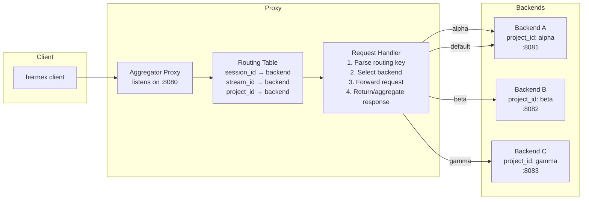

# Hermes Multi-Server Aggregator Proxy

A reverse proxy that presents itself as a single hermes-webui server to hermex (and any hermes-webui-compatible client), while internally routing requests to multiple real hermes-webui backend servers. Each backend server is exposed as a distinct **project** within the aggregated view.

## Table of Contents

1. [Quick Start](#quick-start)
2. [Architecture Overview](#architecture-overview)
3. [Usage Guide](#usage-guide)
4. [Endpoint Redirection](#endpoint-redirection)
5. [Configuration](#configuration)
6. [Troubleshooting](#troubleshooting)

---

## Quick Start

```bash
# 1. Start the proxy (listens on :8080 by default)
python3 hermes_webui_aggregator_proxy.py --config backends.json --port 8080

# 2. In hermex, set the server URL to the proxy:
#    http://your-host:8080
#
# 3. All hermex API calls route through the proxy, transparently
#    directed to the appropriate backend based on project_id.
```

---

## Architecture Overview



The proxy is **transparent** to hermex — it implements the exact same REST + SSE API schema that hermex expects from a single hermes-webui server. Clients connect to one URL and are unaware (for most operations) that multiple backends exist.

### Key Concepts

| Concept | Description |
|---|---|
| **Project** | A backend server, identified by `project_id`. Backends are configured in a JSON config file. |
| **Routing** | Non-streaming API requests are routed to a backend based on `project_id` carried in the request body, `session_id` (in query/body), or `stream_id` (in query params). |
| **Aggregation** | List endpoints (`/api/sessions`, `/api/projects`) merge results from all backends and annotate each entry with its source `project_id`. |
| **SSE Passthrough** | Chat stream SSE connections (`/api/chat/stream`) are proxied byte-for-byte to the backend that owns the `stream_id`. |
| **Default Backend** | If no routing key is present or resolvable, requests go to the configured default backend. |
| **Smart Session Routing** | When `POST /api/session/new` lacks a `project_id`, the proxy uses workspace/model/profile heuristics to select the appropriate backend instead of always defaulting. |

### Routing Hierarchy

The proxy inspects requests for routing keys in this priority order:

1. **`project_id` in request body** → Direct backend lookup by project_id
2. **`stream_id` in query params** → Proxy's in-memory `stream_id → backend` table (populated during `POST /api/chat/start`)
3. **`session_id` in query/body** → Proxy's in-memory `session_id → backend` table (populated from session creation responses and lookups)
4. **No routing key** → Smart session routing (see below), then default backend

### Smart Session Routing

When `POST /api/session/new` arrives without a `project_id` in the body, the proxy applies heuristic routing to select the appropriate backend instead of always falling back to the default. The heuristics, checked in order:

1. **Workspace-path matching** — If the request includes a `workspace` path, match it against each backend's configured workspace roots. A backend that owns that workspace path wins. This is the highest-priority signal because workspace paths map to actual filesystem state on each backend.

   Config example:
   ```json
   {
     "backends": [
       {
         "project_id": "alpha",
         "url": "http://localhost:8081",
         "workspace_roots": ["/home/user/projects/alpha"]
       }
     ]
   }
   ```

2. **Model-provider affinity** — If the request specifies a `model` + `model_provider`, match against backend-claimed provider capabilities. A backend that advertises support for the requested provider wins. This allows routing GPT-5 requests to a backend with GPT-5 credentials and Claude requests to one with Claude credentials.

   Config example:
   ```json
   {
     "backends": [
       {
         "project_id": "openai-backend",
         "url": "http://localhost:8081",
         "providers": ["openai", "azure"]
       }
     ]
   }
   ```

3. **Profile affinity** — If the request specifies a `profile`, route to the backend that owns that profile (if profiles are partitioned across backends). This is useful when each backend runs a different hermes-webui profile configuration.

   Config example:
   ```json
   {
     "backends": [
       {
         "project_id": "alpha",
         "url": "http://localhost:8081",
         "profiles": ["default", "work"]
       }
     ]
   }
   ```

4. **Last-used session affinity** — Track which backend was used for the most recent session creation on this proxy instance. If the new request has no other routing signal, route to that same backend (locality of reference — users often continue working in the same context).

5. **Load balancing** — If no heuristic matches, distribute new sessions across backends using round-robin or least-loaded, rather than always sending to the default backend. This prevents the default backend from being overwhelmed.

If none of the above heuristics match, the proxy falls back to the **default backend** as before.

**Session-affinity caching:** Once any `POST /api/session/new` is routed to a backend, the proxy records `session_id → backend` in its routing table (extracted from the response). All subsequent requests referencing that `session_id` (chat start, file access, session updates, etc.) are routed to the same backend regardless of other heuristics. This ensures session continuity even if heuristics would otherwise route differently on a follow-up request.

---

## Usage Guide

### Connecting hermex to the Proxy

Configure hermex's server URL to point at the proxy:

```
Server URL: http://your-proxy-host:8080
```

No hermex code changes are required. The proxy implements all endpoints hermex expects.

### Working with Projects

Once connected, `GET /api/projects` returns a merged list of projects from all backends. The proxy annotates each project with a `_backend_project_id` field indicating which backend server owns it:

```json
{
  "projects": [
    {"_backend_project_id": "alpha", "project_id": "a1b2c3d4e5f6", "name": "Alpha Project", "color": "#3B82F6", "created_at": 1234567890.0, "profile": "default"},
    {"_backend_project_id": "alpha", "project_id": "f7e8d9c0a1b2", "name": "Alpha Project 2", "color": "#EF4444", "created_at": 1234567891.0, "profile": "default"},
    {"_backend_project_id": "beta", "project_id": "c3d4e5f6a7b8", "name": "Beta Project", "color": "#10B981", "created_at": 1234567892.0, "profile": "default"}
  ],
  "all_profiles": false,
  "active_profile": "default",
  "other_profile_count": 0
}
```

> **Note:** Each hermes-webui backend maintains its own projects with internal `project_id` fields (12-char hex UUIDs). The proxy does NOT overwrite these. Instead, the proxy adds `_backend_project_id` to indicate which backend server the project lives on. This is the routing key used for subsequent `POST /api/projects/create` requests that specify `project_id` in the body.

To create a session tied to a specific project backend, include `project_id` in the `POST /api/session/new` body. **Note that hermex's `NewSessionRequest` does not currently send `project_id`** — the proxy adds it based on the client's selected backend context. The hermes-webui backend accepts `project_id` in the body (verified at `routes.py:16035`):

```json
POST /api/session/new
{
  "workspace": "/home/user/code",
  "model": "gpt-4",
  "project_id": "beta"
}
```

This session is created on **Backend B** (the beta backend). The response session object will have the backend's internal `project_id` (e.g., `"c3d4e5f6a7b8"`) if one was assigned.

### Session Discovery

`GET /api/sessions` returns sessions from all backends, with each entry annotated with `_backend_project_id` indicating which backend server owns it. Each session also carries its own internal `project_id` (the 12-char hex from the backend's project system):

```json
{
  "sessions": [
    {
      "_backend_project_id": "alpha",
      "session_id": "abc123",
      "title": "Debugging the auth module",
      "project_id": "a1b2c3d4e5f6",
      "workspace": "/code",
      "model": "claude-3.5-sonnet",
      "message_count": 12,
      "created_at": 1234567890.0,
      "updated_at": 1234567900.0
    },
    {
      "_backend_project_id": "beta",
      "session_id": "def456",
      "title": "New feature brainstorm",
      "project_id": "c3d4e5f6a7b8",
      "workspace": "/projects/beta",
      "model": "gpt-4",
      "message_count": 3,
      "created_at": 1234567895.0,
      "updated_at": 1234567898.0
    }
  ],
  "cli_count": 0,
  "archived_count": 5,
  "server_time": 1234568000.0,
  "server_tz": "+0000"
}
```

When you subsequently open a session (e.g., fetch `GET /api/session?session_id=abc123`), the proxy looks up which backend owns that session and routes the request accordingly.

---

## Endpoint Redirection

See [endpoint-redirection-diagrams.md](./endpoint-redirection-diagrams.md) for detailed Mermaid sequence/timing diagrams of each endpoint's routing path. The tables below summarize the routing.

### Routing Strategy Summary

| Routing Signal | Source | Example |
|---|---|---|
| `project_id` in request body | `POST /api/session/new`, `POST /api/projects/create`, `POST /api/goal` | `{"project_id": "alpha", ...}` |
| `session_id` in query/body | `GET /api/session`, `POST /api/chat/start`, `POST /api/session/rename`, etc. | `?session_id=abc123` |
| `stream_id` in query param | `GET /api/chat/stream`, `GET /api/chat/cancel`, `GET /api/chat/stream/status` | `?stream_id=...` |
| No routing key / unknown session | **Default backend** | — |
| Aggregation required | `GET /api/sessions`, `GET /api/projects`, `GET /api/sessions/search` | N/A — broadcast to all backends |

### Key API Response Schemas

**POST `/api/chat/start`** (response from hermes-webui, via `_start_chat_stream_for_session` → `_chat_start_response_from_run_start`):
```json
{
  "stream_id": "abc123def456",
  "session_id": "sess123",
  "pending_started_at": 1234567890.0,
  "turn_id": "turn_abc",
  "title": "Untitled",
  "effective_model": "gpt-4",
  "effective_model_provider": "openai"
}
```
On error (e.g., session in use, 409):
```json
{
  "error": "session already has an active stream",
  "active_stream_id": "str_old",
  "code": "session_profile_mismatch"
}
```

**GET `/api/chat/stream?stream_id=<id>`** — SSE stream. Journaled events include `id: <event_id>` headers for resume. Terminal events: `stream_end`, `cancel`, `apperror`, `error`.

**POST `/api/session/new`** — Request:
```json
{
  "workspace": "/home/user/code",
  "model": "gpt-4",
  "model_provider": "openai",
  "profile": "default",
  "project_id": "alpha",
  "enabled_toolsets": ["web", "bash"]
}
```
Response:
```json
{
  "session": {
    "session_id": "sess123",
    "title": "Untitled",
    "workspace": "/home/user/code",
    "model": "gpt-4",
    "model_provider": "openai",
    "message_count": 0,
    "created_at": 1234567890.0,
    "updated_at": 1234567890.0,
    "project_id": "a1b2c3d4e5f6",  // the backend's internal project_id (if assigned), NOT the routing key
    "profile": "default",
    ...
  }
}
```

**GET `/api/sessions`** — Response includes:
```json
{
  "sessions": [...],
  "sidebar_reference_sessions": [...],
  "cli_count": 0,
  "archived_count": 5,
  "archived_webui_count": 0,
  "archived_cli_count": 0,
  "include_archived": false,
  "all_profiles": false,
  "active_profile": "default",
  "other_profile_count": 0,
  "server_time": 1234568000.0,
  "server_tz": "+0000"
}
```
hermex decodes: `sessions`, `cliCount`, `archivedCount`, `serverTime`, `serverTz`. All fields are optional in hermex's `SessionsResponse`.

**GET `/api/projects`** — Response:
```json
{
  "projects": [
    {"project_id": "abc123def", "name": "My Project", "color": "#3B82F6", "profile": "default", "created_at": 1234567890.0}
  ],
  "all_profiles": false,
  "active_profile": "default",
  "other_profile_count": 0
}
```
hermex decodes: `projectId`, `name`, `color`, `createdAt` per `ProjectSummary`. All fields are optional.

### Non-Streaming REST Endpoint Routing

| Method | Path | Routing Key | Behavior |
|---|---|---|---|
| `GET` | `/health` | N/A | Returns aggregated backend health. |
| `GET` | `/api/auth/status` | default backend | Routed to default backend. |
| `GET` | `/api/sessions` | aggregate | Broadcast to all backends. Each session annotated with source `project_id`. Returns merged `sessions` array. |
| `GET` | `/api/sessions/search` | broadcast | Broadcast search query to all backends, merge `sessions` results. |
| `GET` | `/api/session` | `session_id` query | Look up owning backend for `session_id`, route there. |
| `GET` | `/api/session/status` | `session_id` query | Same lookup logic as `/api/session`. |
| `GET` | `/api/session/yolo` | `session_id` query | Same lookup logic. |
| `GET` | `/api/session/export` | `session_id` query | Same lookup logic. |
| `GET` | `/api/projects` | aggregate | Broadcast to all backends. Each project annotated with source `project_id`. |
| `GET` | `/api/workspaces` | default backend | Routed to default backend. |
| `GET` | `/api/workspaces/suggest` | default backend | Routed to default backend. |
| `GET` | `/api/models` | default backend | Routed to default backend (model catalog is server-specific). |
| `GET` | `/api/models/live` | default backend | Routed to default backend. |
| `GET` | `/api/model/auxiliary` | default backend | Routed to default backend. |
| `GET` | `/api/providers` | default backend | Routed to default backend. |
| `GET` | `/api/provider/quota` | default backend | Routed to default backend. |
| `GET` | `/api/settings` | default backend | Routed to default backend. |
| `GET` | `/api/personalities` | default backend | Routed to default backend. |
| `GET` | `/api/profiles` | default backend | Routed to default backend. |
| `GET` | `/api/default-model` | default backend | Routed to default backend. |
| `GET` | `/api/reasoning` | default backend | Routed to default backend. |
| `GET` | `/api/commands` | default backend | Routed to default backend. |
| `GET` | `/api/prompts` | default backend | Routed to default backend. |
| `GET` | `/api/updates/check` | default backend | Routed to default backend. |
| `GET` | `/api/insights` | default backend | Routed to default backend. |
| `GET` | `/api/crons` | default backend | Routed to default backend. |
| `GET` | `/api/crons/status` | default backend | Routed to default backend (`job_id` query). |
| `GET` | `/api/crons/history` | default backend | Routed to default backend (`job_id` query). |
| `GET` | `/api/crons/output` | default backend | Routed to default backend (`job_id` query). |
| `GET` | `/api/crons/recent` | default backend | Routed to default backend. |
| `GET` | `/api/crons/delivery-options` | default backend | Routed to default backend. |
| `GET` | `/api/memory` | default backend | Routed to default backend. |
| `GET` | `/api/skills` | default backend | Routed to default backend. |
| `GET` | `/api/skills/content` | default backend | Routed to default backend (`name` + `file` query). |
| `GET` | `/api/list` | `session_id` query | Route to backend owning the session. |
| `GET` | `/api/file` | `session_id` query | Route to backend owning the session. |
| `GET` | `/api/file/raw` | `session_id` query | Route to backend owning the session. |
| `GET` | `/api/media` | `session_id` query | Route to backend owning the session. |
| `GET` | `/api/git-info` | `session_id` query | Route to backend owning the session. |
| `GET` | `/api/git/status` | `session_id` query | Route to backend owning the session. |
| `GET` | `/api/git/branches` | `session_id` query | Route to backend owning the session. |
| `GET` | `/api/git/diff` | `session_id` query | Route to backend owning the session. |
| `GET` | `/api/chat/stream` | `stream_id` query | Look up backend owning `stream_id`. Byte-for-byte SSE passthrough. |
| `GET` | `/api/chat/stream/status` | `stream_id` query | Route to backend owning the `stream_id`. |
| `GET` | `/api/chat/cancel` | `stream_id` query | Route to backend owning the `stream_id`. |
| `GET` | `/api/approval/pending` | `session_id` query | Route to backend owning the session. |
| `GET` | `/api/approval/stream` | `session_id` query | Route to backend owning the session. SSE passthrough. |
| `GET` | `/api/clarify/pending` | `session_id` query | Route to backend owning the session. |
| `GET` | `/api/clarify/stream` | `session_id` query | Route to backend owning the session. SSE passthrough. |
| `GET` | `/api/background/status` | `session_id` query | Route to backend owning the session. |
| `GET` | `/api/session/stream` | `session_id` query | Route to backend owning the session. SSE passthrough. |
| `GET` | `/api/terminal/output` | `stream_id` query | Route to backend owning the `stream_id`. SSE passthrough. |

### POST Endpoint Routing

| Method | Path | Routing Key | Behavior |
|---|---|---|---|
| `POST` | `/api/session/new` | `project_id` body | Route to backend matching `project_id` (or default). Record `session_id → backend` mapping from response. |
| `POST` | `/api/session/rename` | `session_id` body | Route to backend owning the session. |
| `POST` | `/api/session/delete` | `session_id` body | Route to backend owning the session. |
| `POST` | `/api/session/pin` | `session_id` body | Route to backend owning the session. |
| `POST` | `/api/session/archive` | `session_id` body | Route to backend owning the session. |
| `POST` | `/api/session/branch` | `session_id` body | Route to backend owning the session. |
| `POST` | `/api/session/duplicate` | `session_id` body | Route to backend owning the session. |
| `POST` | `/api/session/compress` | `session_id` body | Route to backend owning the session. |
| `POST` | `/api/session/clear` | `session_id` body | Route to backend owning the session. |
| `POST` | `/api/session/undo` | `session_id` body | Route to backend owning the session. |
| `POST` | `/api/session/retry` | `session_id` body | Route to backend owning the session. |
| `POST` | `/api/session/truncate` | `session_id` body | Route to backend owning the session. |
| `POST` | `/api/session/update` | `session_id` body | Route to backend owning the session. |
| `POST` | `/api/session/yolo` | `session_id` body | Route to backend owning the session. |
| `POST` | `/api/session/move` | `session_id` body | Route to backend owning the session. |
| `POST` | `/api/projects/create` | `project_id` body | Route to backend matching `project_id` (or default). |
| `POST` | `/api/projects/rename` | `project_id` body | Route to backend matching `project_id`. |
| `POST` | `/api/projects/delete` | `project_id` body | Route to backend matching `project_id`. |
| `POST` | `/api/chat/start` | `session_id` body | Route to backend owning the session. **Record** `stream_id → backend` mapping from response. |
| `POST` | `/api/chat/steer` | `session_id` body | Route to backend owning the session. |
| `POST` | `/api/goal` | `project_id` body or default | Route to backend matching `project_id` (or default). |
| `POST` | `/api/btw` | `session_id` body | Route to backend owning the session. |
| `POST` | `/api/background` | `session_id` or `project_id` body | Route to backend owning the session. |
| `POST` | `/api/approval/respond` | `session_id` body | Route to backend owning the session. |
| `POST` | `/api/clarify/respond` | `session_id` body | Route to backend owning the session. |
| `POST` | `/api/file/save` | `session_id` body | Route to backend owning the session. |
| `POST` | `/api/file/delete` | `session_id` body | Route to backend owning the session. |
| `POST` | `/api/file/create` | `session_id` body | Route to backend owning the session. |
| `POST` | `/api/git/commit` | `session_id` body | Route to backend owning the session. |
| `POST` | `/api/git/stage` | `session_id` body | Route to backend owning the session. |
| `POST` | `/api/providers` | N/A | Routed to default backend (sets API keys). |
| `POST` | `/api/settings` | N/A | Routed to default backend (saves settings). |
| `POST` | `/api/updates/apply` | N/A | Routed to default backend. |
| `POST` | `/api/profile/switch` | `profile` body | Routed to default backend (profile management). |
| `POST` | `/api/skills` | N/A | Routed to default backend. |
| `POST` | `/api/skills/content` | N/A | Routed to default backend. |

### SSE Streaming Passthrough

| Endpoint | Routing Key | SSE Behavior |
|---|---|---|
| `GET /api/chat/stream` | `stream_id` query | Look up backend owning `stream_id`. Proxy SSE byte-for-byte. Forward `Last-Event-ID` header for journal resume. Preserve `id:` event IDs. Terminal events (`stream_end`, `cancel`, `apperror`, `error`) close the proxied connection. |
| `GET /api/chat/stream/status` | `stream_id` query | Route to backend owning the `stream_id`. |
| `GET /api/chat/cancel` | `stream_id` query | Route to backend owning the `stream_id`. |
| `GET /api/approval/stream` | `session_id` query | Route to backend owning the session. SSE passthrough. |
| `GET /api/clarify/stream` | `session_id` query | Route to backend owning the session. SSE passthrough. |

### SSE Resume / Reconnect

The hermes-webui server emits `id: <event_id>` for journaled events (via `_sse_with_id()`). On reconnect, spec-compliant SSE clients (like hermex's `LDSwiftEventSource`) automatically send the `Last-Event-ID` header. The proxy must:

1. Forward the `Last-Event-ID` header to the backend SSE stream handler.
2. Pass through all `id:`, `event:`, and `data:` lines byte-for-byte without modification.
3. Pass `after_seq`, `after_event_id`, and `replay=1` query params through unchanged if hermex uses them (verified: hermex sends `replay=1` + `after_seq` on reconnect via `chatStreamURL(streamID:replayAfterSeq:)`).

> **Resume protocol precedence** (verified at `routes.py:18869`): explicit query params (`after_seq`, `after_event_id`) take precedence over the `Last-Event-ID` header. The proxy must NOT rewrite or synthesize these — pass them all through as-is.

### SSE Event Types

The proxy does NOT interpret SSE events — it passes them byte-for-byte. For reference, the terminal events (which close the stream) are: `stream_end`, `cancel`, `apperror`, `error`. Non-terminal events include: `token`, `interim_assistant`, `reasoning`, `tool`, `tool_complete`, `title`, `metering`, `done`, `approval`, `clarify`, `initial`, `pending_steer_leftover`, `compressing`, `runtime_model`, `warning`, `goal_continue`, `goal`, `title_status`, `context_status`, `compressed`, `state_saved`.

---

## Configuration

### Backend Configuration File (`backends.json`)

```json
{
  "backends": [
    {
      "project_id": "alpha",
      "url": "http://localhost:8081",
      "auth_token": "secret-token-alpha",
      "name": "Alpha Backend",
      "workspace_roots": ["/home/user/projects/alpha"],
      "providers": ["openai", "anthropic"],
      "profiles": ["default", "work"]
    },
    {
      "project_id": "beta",
      "url": "http://localhost:8082",
      "auth_token": "secret-token-beta",
      "name": "Beta Backend",
      "workspace_roots": ["/home/user/projects/beta"],
      "providers": ["openai"],
      "profiles": ["default"]
    },
    {
      "project_id": "gamma",
      "url": "http://localhost:8083",
      "auth_token": "secret-token-gamma",
      "name": "Gamma Backend"
    }
  ],
  "default_backend": "alpha",
  "proxy_port": 8080,
  "auth_token": "proxy-auth-token-optional"
}
```

### Configuration Fields

| Field | Required | Description |
|---|---|---|
| `backends` | Yes | List of backend configurations. |
| `backends[].project_id` | Yes | Unique identifier for the backend. Used as the primary routing key. |
| `backends[].url` | Yes | Base URL of the hermes-webui backend server. |
| `backends[].auth_token` | No | If set, forwarded as `Authorization: Bearer <token>` to the backend. |
| `backends[].name` | No | Human-readable name (used as fallback display name for projects from this backend). |
| `backends[].workspace_roots` | No | List of workspace paths that this backend owns. Used for workspace-path-based routing in `POST /api/session/new`. |
| `backends[].providers` | No | List of LLM provider IDs (e.g., `"openai"`, `"anthropic"`) that this backend can serve. Used for model-provider affinity routing. |
| `backends[].profiles` | No | List of hermes-webui profile names that this backend owns. Used for profile-based routing. |
| `default_backend` | No | `project_id` of the backend used when no routing key is present. If omitted, the first backend is used. |
| `proxy_port` | No | Port for the proxy to listen on. Default: `8080`. |
| `auth_token` | No | If set, the proxy requires this token in the `Authorization` header from clients. |

### Environment Variables

| Variable | Description |
|---|---|
| `AGGREGATOR_CONFIG` | Path to the backend config JSON file. Default: `backends.json` in the working dir. |
| `AGGREGATOR_PORT` | Override the proxy listen port. |

---

## Troubleshooting

### Session not found on correct backend

If a session is created on one backend but a subsequent request routes to the wrong one, verify that the `session_id` is being passed in the request body or query string. The proxy maintains an in-memory routing table of `session_id → backend` that is populated when sessions are created (via `POST /api/session/new` response) or first looked up (via `GET /api/session`). If a session was created directly on a backend (bypassing the proxy), the first `GET /api/session` request will probe all backends to find it, then cache the mapping.

### SSE stream disconnects

The proxy passes SSE events byte-for-byte. If a backend restarts, the proxy cannot replay journal events — the client must issue a new `POST /api/chat/start` to create a fresh stream. The `Last-Event-ID` header is forwarded to the backend for journal-based resume, but this only works against the same backend that owns the stream_id.

### Project list shows unexpected projects

Each backend maintains its own independent project list. If two backends define projects with the same `project_id`, the proxy will still route correctly (the `project_id` in the project's own response is the backend's own, not the proxy's routing key). The proxy annotates each project with `_backend_project_id` to indicate which backend server the project lives on — these may differ from the project's internal `project_id` field.

### Authentication errors (401/403) from backends

Verify that `backends[].auth_token` in your config matches what each backend expects. The proxy forwards this as `Authorization: Bearer <token>`. If your backends use a different auth mechanism, you may need to extend the proxy's header-forwarding logic.
