# Endpoint Redirection Diagrams

This document visualizes how hermex API requests flow through the aggregator proxy to individual hermes-webui backend servers, based on `project_id` routing. All diagrams use [Mermaid](https://mermaid.js.org/) syntax.

---

## High-Level Architecture

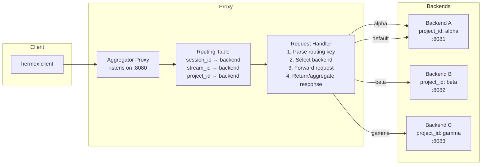

---

## Routing Decision Flow

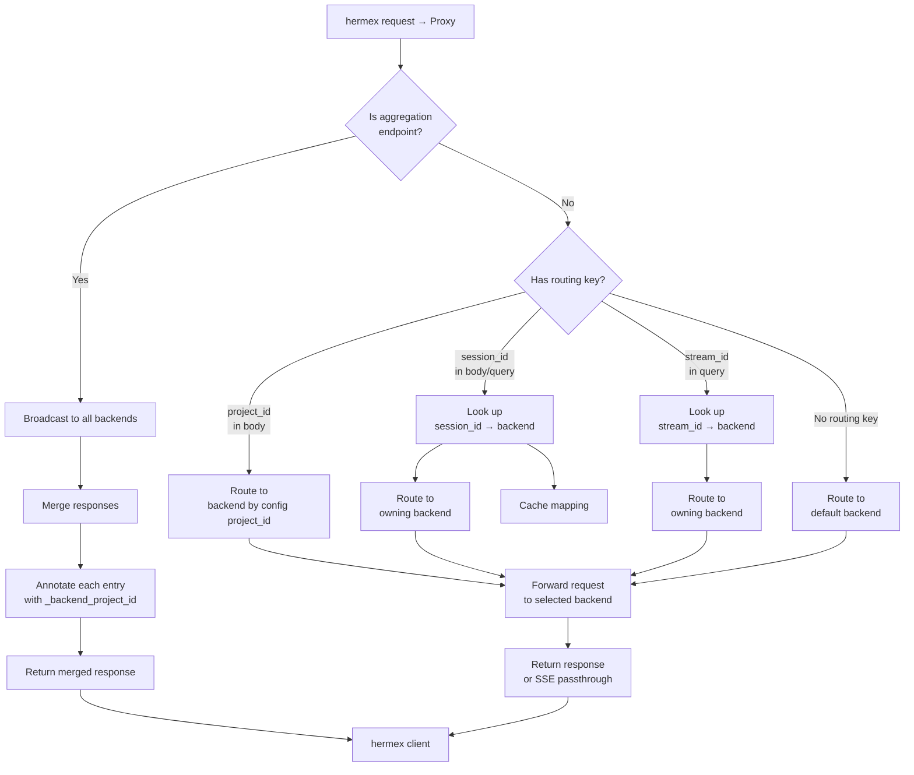

---

## Project Creation & Management

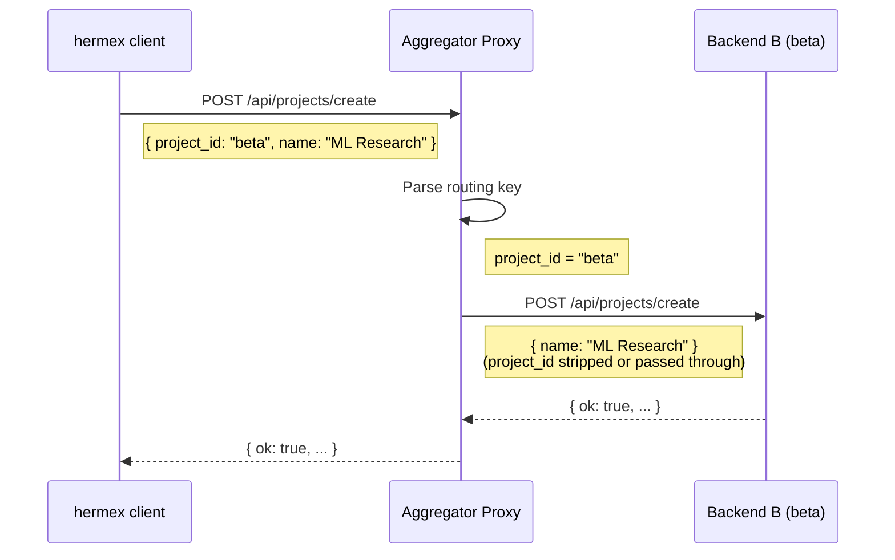

---

## Session Creation (Project Selection)

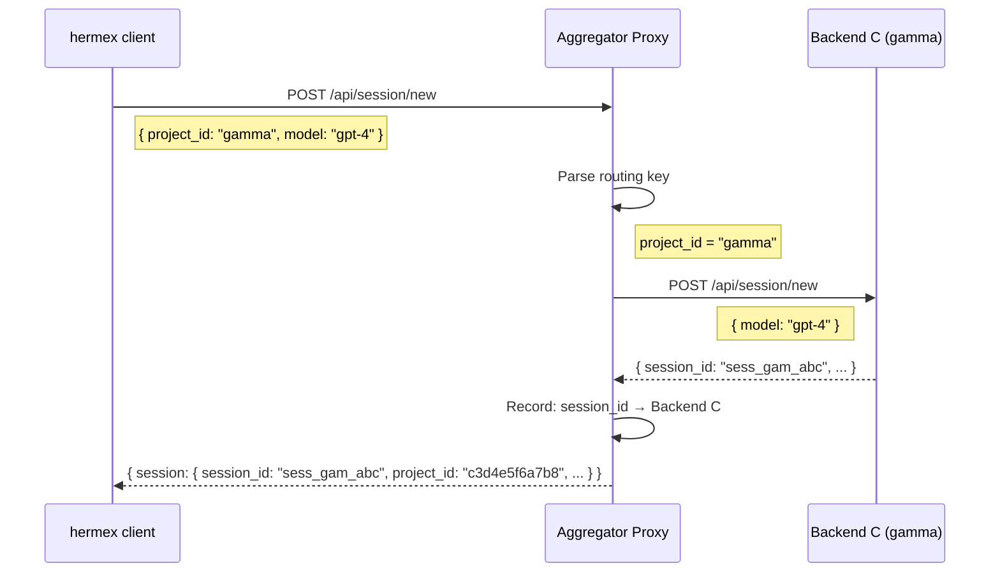

---

## Session Listing (Aggregation)

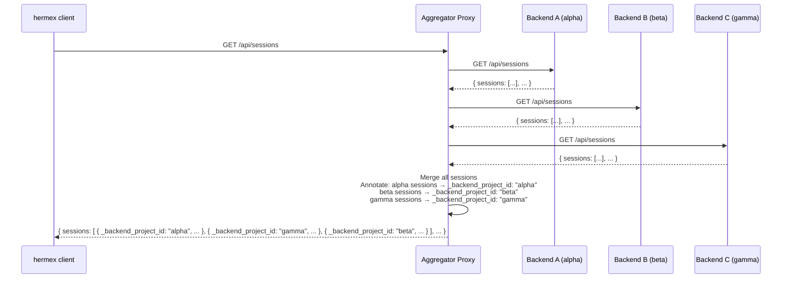

---

## Opening a Session (Session Lookup)

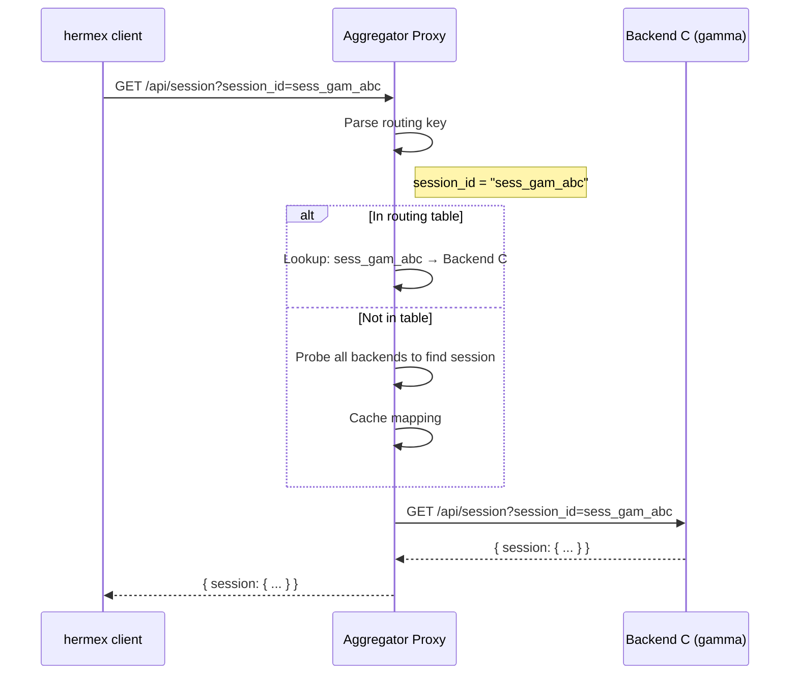

---

## Chat Start (Session → Backend Routing)

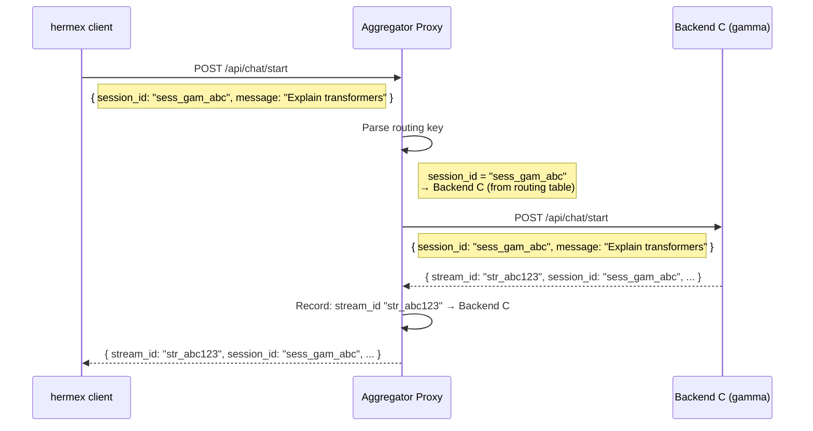

---

## Chat Stream SSE (Stream ID → Backend Routing)

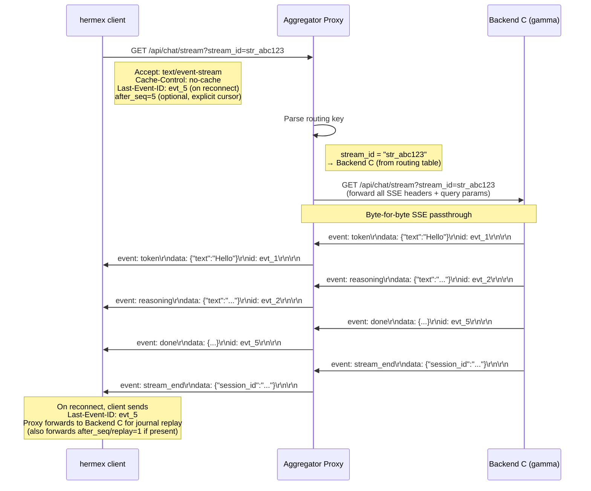

---

## Chat Steer (Session → Backend Routing)

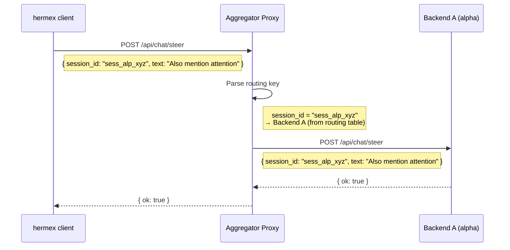

---

## Project Listing (Aggregation)

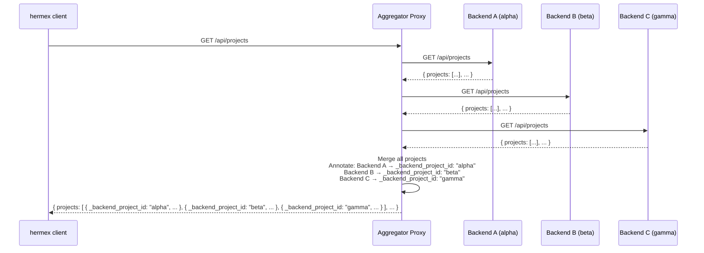

---

## Approval / Clarification Streams

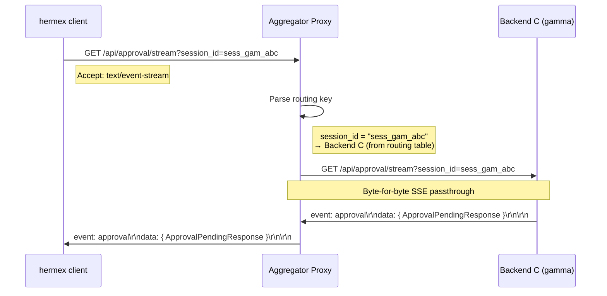

---

## File Access (Session → Backend Routing)

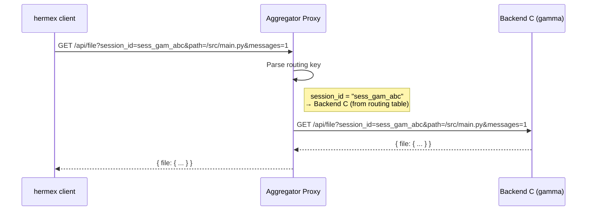

---

## Session Search (Aggregation / Broadcast)

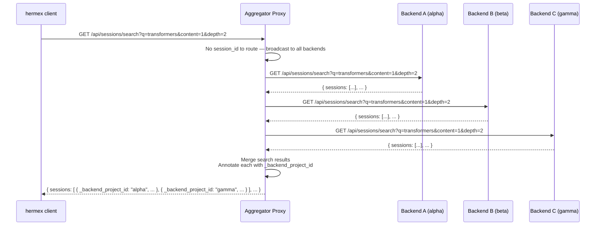

---

## Routing Key Summary Table

| Endpoint Pattern | Routing Key Extracted From | Fallback |
|---|---|---|
| `POST /api/session/new` | `project_id` (body) or smart heuristics (workspace/model/provider) | default backend (after smart heuristics) |
| `POST /api/projects/create` | `project_id` (body) | default backend |
| `POST /api/projects/rename` | `project_id` (body) | default backend |
| `POST /api/projects/delete` | `project_id` (body) | default backend |
| `POST /api/chat/start` | `session_id` (body) | default backend |
| `POST /api/chat/steer` | `session_id` (body) | default backend |
| `POST /api/goal` | `project_id` (body) or smart heuristics | default backend (after smart heuristics) |
| `POST /api/btw` | `session_id` (body) | default backend |
| `POST /api/background` | `session_id` or `project_id` (body) | default backend |
| `POST /api/session/*` (rename/delete/pin/archive/branch/duplicate/compress/clear/undo/retry/truncate/update/yolo/move) | `session_id` (body) | default backend |
| `POST /api/approval/respond` | `session_id` (body) | default backend |
| `POST /api/clarify/respond` | `session_id` (body) | default backend |
| `POST /api/file/*` (save/delete/create) | `session_id` (body) | default backend |
| `POST /api/git/*` (commit/stage) | `session_id` (body) | default backend |
| `GET /api/session` | `session_id` (query) | default backend |
| `GET /api/session/status` | `session_id` (query) | default backend |
| `GET /api/session/yolo` | `session_id` (query) | default backend |
| `GET /api/session/export` | `session_id` (query) | default backend |
| `GET /api/chat/stream` | `stream_id` (query) | default backend |
| `GET /api/chat/stream/status` | `stream_id` (query) | default backend |
| `GET /api/chat/cancel` | `stream_id` (query) | default backend |
| `GET /api/approval/stream` | `session_id` (query) | default backend |
| `GET /api/clarify/stream` | `session_id` (query) | default backend |
| `GET /api/background/status` | `session_id` (query) | default backend |
| `GET /api/list` | `session_id` (query) | default backend |
| `GET /api/file` | `session_id` (query) | default backend |
| `GET /api/file/raw` | `session_id` (query) | default backend |
| `GET /api/media` | `session_id` (query) | default backend |
| `GET /api/git-info` | `session_id` (query) | default backend |
| `GET /api/git/status` | `session_id` (query) | default backend |
| `GET /api/git/branches` | `session_id` (query) | default backend |
| `GET /api/git/diff` | `session_id` (query) | default backend |
| `GET /api/sessions` | N/A — aggregate all backends | N/A |
| `GET /api/sessions/search` | `query` params — broadcast to all | N/A |
| `GET /api/projects` | N/A — aggregate all backends | N/A |
| `GET /health` | N/A — proxy health | N/A |
| All other `GET`/`POST` | N/A | default backend |
